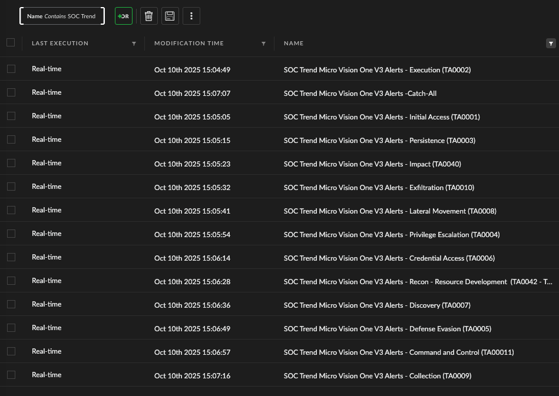

# SOC Trend Micro Vision One – Product Enhancement Configuration

This repository contains configuration assets and playbooks that enhance the Trend Micro Vision One integration within Cortex XSIAM. These enhancements improve visibility, triage workflows, and automation by aligning Vision One alerts to the SOC Framework and MITRE ATT&CK tactics.

## 📌 Overview

Trend Micro Vision One is a valuable telemetry source that produces high-fidelity alerts, but often requires tuning and enrichment to integrate cleanly into XSIAM workflows. This enhancement package enables:

- A custom layout rule for Vision One alerts
- MITRE tactic–aligned correlation rules for early grouping
- A fallback correlation rule for unmapped alerts
- Playbook for Vision One alert enrichment (Executed by the Upon Trigger)

## 🚀 Getting Started

### Step 1: Create a Layout Rule for Vision One Alerts

To improve the analyst experience and prioritize Vision One-specific fields:

Go To: **Settings → Configurations → Object Setup → Layout Rules**

- **Rule Name:** `Trend Micro Vision One Alert Layout`
- **Layout To Display:** `SOC Trend Micro Vision One XDR Incident`
- **Filter Criteria:**
    - Tags: Equals `DS:Trend Micro Vision One V3`
- **Action:**
    - Assign a custom alert layout optimized for Vision One alert data

> This layout should surface key fields like `CommandLine`, `FilePath`, `Sensor ID`, `Tactic`, `Technique`, and `Severity`.

#### 🖼️ Layout Rule Visualization

> This layout rule ensures the most relevant fields are presented to analysts working Vision One-related alerts.

### Step 2: Enable MITRE Tactic–Based Correlation Rules

Enable correlation rules that group Vision One alerts into incidents based on their mapped MITRE ATT&CK tactic.

Go To: **Detection & Correlation → Correlation Rules**

Enable the following rules:

> These rules use fields like `MITRE Tactic`, `cmdline`, and `host` to group relevant alerts into single, actionable incidents.

> This visualization maps how Vision One alerts are organized by tactic to drive meaningful triage and response workflows.

## 🧠 Why This Matters

These configurations align with XSIAM FieldOps Model pillars:

| Value Driver          | Capability Delivered                                              |
|----------------------|-------------------------------------------------------------------|
| Transformation        | Analysts see clean, consistent layouts across all Vision One alerts   |
| Risk & Resiliency     | MITRE alignment improves coverage and detection granularity       |
| Automation & Efficacy | Alert correlation minimizes noise and drives automated workflows  |

## 🧪 Validation Tips

- Use **BYOS MITRE Lab** to simulate Vision One alerts across different tactics
- Confirm layout rules apply only to Vision One alerts
- Ensure correlation rules create grouped incidents per tactic or fallback logic
- Monitor grouped incidents in the **Value Dashboard** to assess rule effectiveness

## 🧩 Dependencies

- Custom Alert Layout (JSON layout file)
- SOC Optimization Framework (for scoring and triage)

---

For questions or help extending this pack, reach out to your Palo Alto Networks Field team or SOC Framework maintainers.